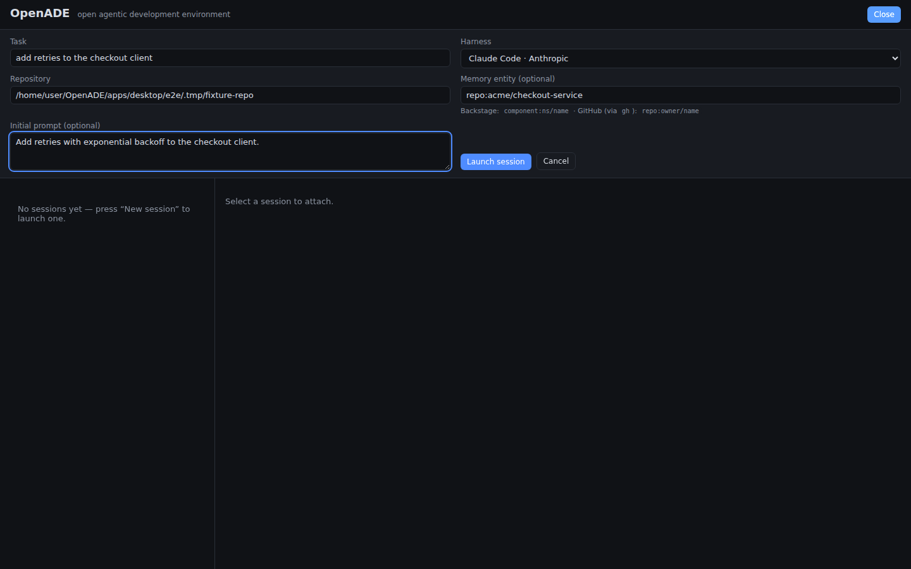
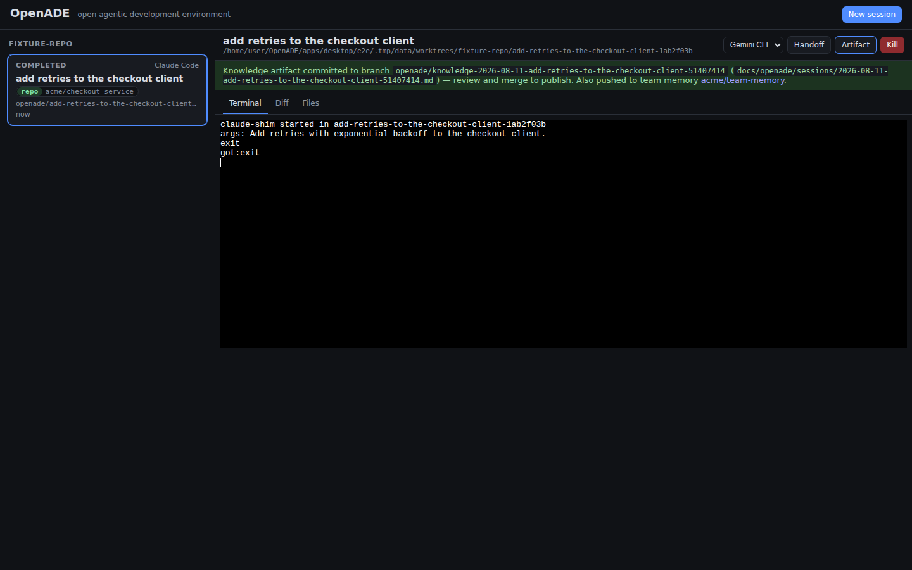
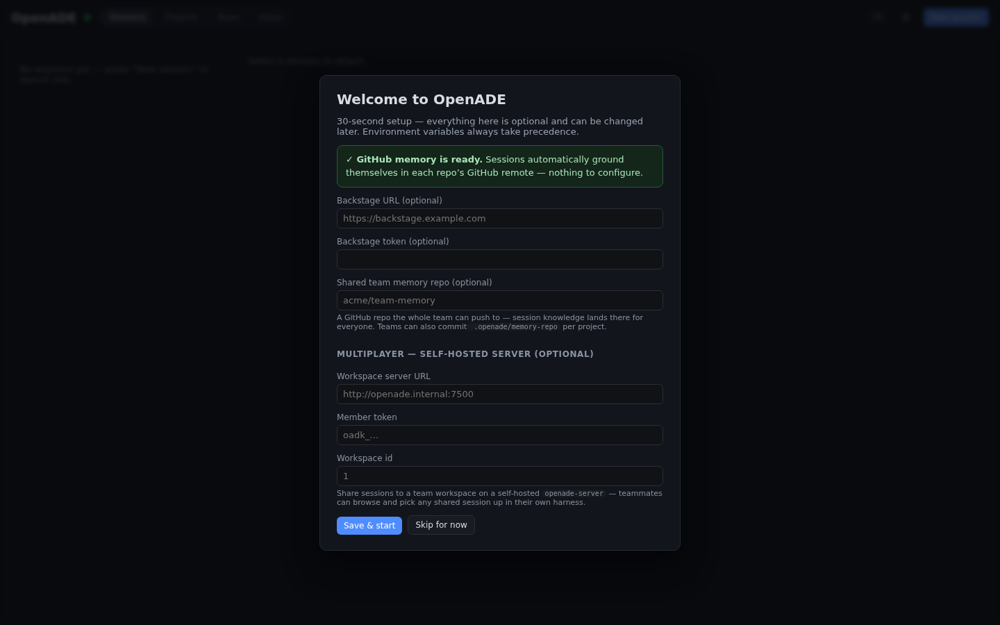
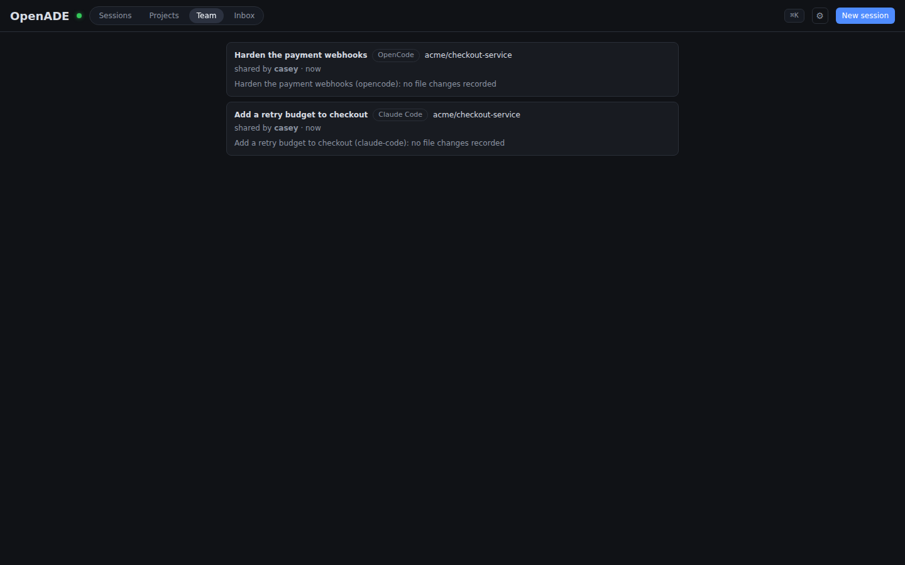
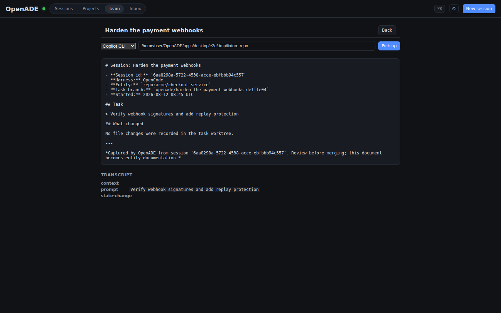
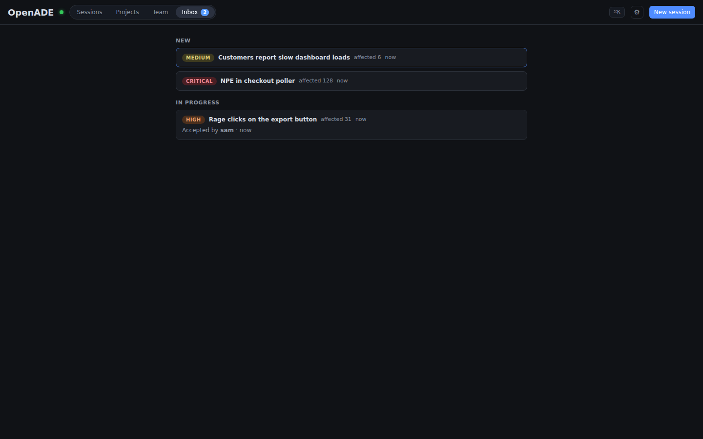
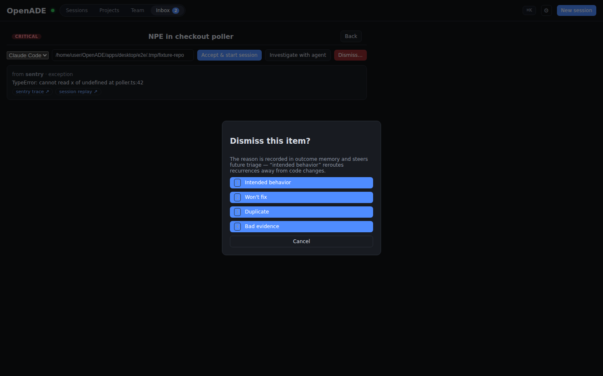

# OpenADE

**An open, vendor-neutral agentic development environment.**

OpenADE orchestrates parallel AI coding agent sessions — **Claude Code,
Codex CLI, Gemini CLI, Copilot CLI, OpenCode** — in isolated Git worktrees from a
single control surface,
and grounds every session in organizational memory via **MCP**: a
**Backstage** software catalog (ownership, dependencies, APIs, ADRs,
TechDocs) and/or **GitHub repositories** through your locally-authenticated
`gh` CLI (repo metadata, CODEOWNERS ownership, README/docs). Session
knowledge flows back as reviewed documentation, so every session makes the
next one smarter.

The context layer is open and pluggable — the inverse of commercial,
closed-context agent environments. Bring your own catalog; no accounts, no
telemetry, local-first.


## What it does

- **Parallel sessions, zero collisions** — every task gets its own Git
  worktree on its own branch, with a dirty-state guard on cleanup — or run
  a session directly in the main checkout when you want the tree you
  already have open (the main checkout is never cleaned up).
- **Persistent PTY sessions** — harnesses run in daemon-owned terminals that
  survive the window closing; reattach with full scrollback. Session states
  (`running` / `needs-input` / `completed` / `failed`) surface in a grid,
  including prompt detection for "the agent is waiting on you".
- **Context-grounded sessions, zero config** — memory works without
  thinking about it: launch a session with no entity named and it grounds
  itself in the repo's own GitHub `origin` remote. The agent starts with a
  budgeted context bundle (owner, dependencies, APIs, docs, prior session
  outcomes) injected into its rules file, plus the `catalog` MCP server
  registered for on-demand retrieval (`get_entity`, `get_owner`,
  `get_dependencies`, `get_apis_for_entity`, `search_catalog`,
  `get_techdocs_page`). Naming an entity is only for overriding: two memory
  sources, routed by ref — `component:ns/name` → Backstage;
  `repo:owner/name` → GitHub via your local `gh` CLI (OpenADE never touches
  GitHub credentials).
- **Knowledge loop** — one click summarizes a session (transcript + diff)
  into a markdown artifact committed on an `openade/knowledge-*` review
  branch under `docs/`; once merged it feeds the context bundle of the next
  session on that entity.
- **Shared team memory** — commit a one-line `.openade/memory-repo` file
  (`acme/team-memory`) naming a repo the whole team has write access to,
  and every member's published artifacts are *also* pushed straight to its
  default branch (`sessions/<slug>.md` + a living `index.md`) through
  their own local `gh` CLI — configured once for the team, zero setup per
  person (`OPENADE_MEMORY_REPO=owner/name` works too, as a daemon-wide
  default). Entries there matching a session's entity flow back into the
  next context bundle — what any teammate learned, everyone's next session
  knows. GitHub memory needs the [GitHub CLI](https://cli.github.com)
  installed and authenticated (`gh auth login`); the daemon tells you at
  startup — with the fix — if `gh` is missing or logged out.
- **Multiplayer workspaces (self-hosted)** — run the included
  `openade-server` binary and your team gets a shared workspace: press
  **Share** on any session and its harness-neutral record (summary,
  artifact, transcript) is uploaded for teammates to browse in the
  **Team** view — and to **pick up**: anyone can resume any shared
  session, anytime, in *any* harness (a Claude Code session picks up in
  Copilot CLI), in their own clone under their own credentials. Sharing is
  manual and per-session; access is by revocable member tokens; shared
  history on an entity flows into the next session's context bundle
  automatically. Full guide: [docs/multiplayer.md](docs/multiplayer.md).
- **Inbox + outcome memory** — the outside world flows IN: errors,
  tickets, and feedback post a normalized schema to `POST /signals`
  (team server or your local daemon — no login, no new auth) and land in
  a triage **Inbox** with severity, impact, and deep-link evidence.
  Accept an item and a session launches carrying the evidence; dismiss
  it with a structured reason and that lands in **outcome memory**,
  anchored to the signal's fingerprint — a dismissed problem that comes
  back 3× bigger escalates itself back into the queue. When a triage
  session's PR merges (checked through your own `gh`), the verdict feeds
  every future context bundle: memory that knows what actually shipped.
  Full guide: [docs/signals.md](docs/signals.md).
- **Cross-harness handoff** — move a task Claude → Gemini (any direction) in
  place: same worktree and branch, rules re-materialized, a written handoff
  summary, and the new harness prompted to pick up where the old one left
  off.
- **One rules source** — `.openade/rules.md` materializes to `CLAUDE.md` /
  `AGENTS.md` / `GEMINI.md` so behavior doesn't change when you switch
  models (hand-written files are never clobbered).
- **One control surface** — Sessions and Projects views (per-repo state
  counts, last activity, open PRs via your `gh`, and a goal box: describe
  an outcome, a session launches), a Ctrl/⌘K command palette, a live
  daemon-health dot, collapsible per-project groups with one-click launch,
  cards/compact layouts, per-session Files (click-to-view), Rules, and
  Skills tabs, and a settings dialog that applies changes immediately.

Launching a session grounded in a GitHub repo memory entity:



Publishing its knowledge — review branch locally, pushed to the shared team
memory repo immediately:



## Install

**Current Go/Wails desktop (macOS developer build):** requires Go 1.26+ with
CGO enabled, Node.js 20+, npm, and Wails CLI 2.10.2. It runs one durable local
daemon for all PTYs, worktrees, session indexing, tickets, and pull requests.

```sh
cd apps/desktop
npm ci
go install github.com/wailsapp/wails/v2/cmd/wails@v2.10.2
CGO_ENABLED=1 "$(go env GOPATH)/bin/wails" build
open build/bin/OpenADE.app
```

For live UI development, replace `build` with `dev`. The desktop shell starts
or reconnects to the daemon on `127.0.0.1:7433`; closing the window does not
terminate active agent sessions.

The desktop supports two provider surfaces. **Native chat** parses structured
Codex or Claude output into streamed Markdown with collapsible activity and a
local skills/commands picker. **Direct TUI** attaches xterm to the provider's
real interactive CLI inside the session worktree; the daemon owns that PTY, so
closing and reopening the desktop does not interrupt it. Independent project
shells remain separate tabs. Settings can also scan a workspace folder for Git
projects and group indexed OpenADE sessions plus existing local Codex and Claude
conversations beneath each project. Selecting imported history creates an
isolated worktree and resumes the original conversation in its provider TUI.

**From a release** (Linux x86_64/aarch64, macOS Intel/Apple Silicon):
download the tarball for your platform from
[GitHub Releases](https://github.com/hkd987/OpenADE/releases), verify the
checksum, and put `openade-daemon` and `catalog-mcp` on your PATH
(`openade-server` is in the same tarball — only the machine hosting your
team's [multiplayer workspace](docs/multiplayer.md) needs it).

**From source** (Rust 1.80+):

```sh
cargo install --path crates/openade-daemon --path crates/catalog-mcp
cargo install --path crates/openade-server   # team workspace host only
```

The harness CLIs themselves are bring-your-own: install and authenticate
`claude`, `codex`, `gemini`, `copilot`, and/or `opencode` through each vendor's normal
flow. OpenADE never touches their credentials. (Adapter flag mappings are
verified against current CLI releases via the
[Phase 0 spike](docs/phase-0-spike.md) checklist — these tools change
monthly.)

## Quickstart

```sh
# 0. For GitHub memory (repo: entities and the shared team memory repo),
#    install the GitHub CLI (https://cli.github.com) and authenticate:
#      gh auth login && gh auth status
#    OpenADE shells out to your gh — it never stores GitHub credentials.
#    Missing or logged-out gh is reported in the daemon log with the fix.

# 1. Start the daemon (localhost:7433). Memory sources are optional and
#    combine: Backstage via env; GitHub automatically whenever the gh CLI
#    is installed and authenticated (gh auth login).
export BACKSTAGE_BASE_URL=https://backstage.example.com   # optional
export BACKSTAGE_TOKEN=...                                # optional
openade-daemon

# (team, once) commit the shared memory repo into the project —
# every member's OpenADE picks it up with zero personal setup:
echo "acme/team-memory" > /path/to/your/repo/.openade/memory-repo
#   (OPENADE_MEMORY_REPO=owner/name also works as a daemon-wide default)

# 2. Launch a session (or use the UI below). No entity_ref needed —
#    the session grounds itself in the repo's GitHub origin remote.
curl -s -X POST localhost:7433/sessions -H 'content-type: application/json' -d '{
  "title": "add retries to the payments client",
  "harness": "claude-code",
  "repo_root": "/path/to/your/repo",
  "prompt": "Add retries with exponential backoff to the payments client."
}'
# Naming one overrides the auto-detection:
#   "entity_ref": "component:default/payments-api"   (Backstage)
#   "entity_ref": "repo:acme/payments"               (GitHub)

# 3. Run the UI (dev mode; Node 20+)
cd apps/desktop && npm install && npm run dev
```

**First run:** the app opens with a 30-second onboarding that checks your
GitHub CLI (and tells you exactly how to fix it if it's missing or signed
out) and collects the optional settings — Backstage URL/token and the
shared team memory repo. Saved settings live in the daemon's
`config.json` (under `OPENADE_DATA_DIR`) and apply immediately, no
restart; environment variables always take precedence over them.
Everything is skippable because GitHub memory is zero-config.



Useful daemon endpoints: `GET /sessions`, `GET /sessions/{id}/scrollback`,
`POST /sessions/{id}/input`, `GET /sessions/{id}/diff`, `.../files`,
`POST /sessions/{id}/artifact`, `POST /sessions/{id}/handoff`,
`POST /sessions/{id}/share`, `POST /sessions/pickup`, `POST /signals`,
`GET /inbox`, `POST /inbox/{id}/accept|dismiss`,
`POST /sessions/from-inbox`, `POST /sessions/{id}/inbox-outcome`,
`GET /workspace/sessions` (team history, proxied so the member token stays
in the daemon), `DELETE /sessions/{id}`, `DELETE /sessions/{id}/worktree`,
`GET /projects`,
`GET`/`PUT /config` (settings + memory/gh status, used by onboarding).

Environment knobs: `OPENADE_DAEMON_PORT` (default 7433), `OPENADE_DATA_DIR`
(default `~/.openade` — transcripts, session index, worktrees, and the
onboarding-written `config.json`),
`BACKSTAGE_BASE_URL` / `BACKSTAGE_TOKEN` (Backstage memory source),
`OPENADE_GH_BIN` (gh binary override; defaults to the `gh` CLI on PATH),
`OPENADE_GITHUB_MEMORY=0` (kill switch for everything gh-backed: the GitHub
memory source, the shared memory repo, and status probes),
`OPENADE_MEMORY_REPO=owner/name` (daemon-wide
shared team memory repo; a repository's committed `.openade/memory-repo`
file takes precedence — artifacts are pushed directly to its default
branch, so everyone on it needs write access),
`OPENADE_SERVER_URL` / `OPENADE_SERVER_TOKEN` / `OPENADE_SERVER_WORKSPACE`
(multiplayer workspace connection — usually set in the Settings dialog
instead; [docs/multiplayer.md](docs/multiplayer.md) covers the
`openade-server`-side knobs),
`VITE_OPENADE_DAEMON_URL` (UI → daemon).

## Multiplayer (self-hosted)

Give your whole team one shared memory of every agent session. Multiplayer
ships as its own binary in this repo — **`openade-server`** — that any
machine on your network can host; each member's OpenADE connects to it
with a revocable token.

- **Share a session** — press **Share** on any session and its
  harness-neutral record (summary, knowledge artifact, transcript) is
  uploaded to the team workspace. Sharing is manual and per-session:
  nothing leaves a machine implicitly.
- **Browse the team's history** — the **Team** view lists every shared
  session (who shared it, which harness and repo/entity, when, one-line
  summary) with a read-only artifact + transcript viewer.
- **Pick up any session, anytime, in any harness** — choose a harness and
  a local clone, press **Pick up**, and a new local session starts where
  the shared one left off: the record is rendered into that harness's own
  rules file, a `.openade/pickup.md` takeover doc, and its native prompt
  convention. A session shared from Claude Code picks up in OpenCode.
- **Memory compounds** — shared sessions matching an entity feed the next
  session's context bundle automatically, and everything degrades
  gracefully when the server is unreachable.

**Install the server:** download the tarball for your platform from
[**GitHub Releases (latest)**](https://github.com/hkd987/OpenADE/releases/latest)
— `openade-server` is inside every release archive next to
`openade-daemon` — or build it with
`cargo install --path crates/openade-server`. Then:

```sh
# on the host machine (state = one SQLite file under ~/.openade-server)
OPENADE_SERVER_ADMIN_TOKEN=$(openssl rand -hex 24) openade-server

# once, as admin: create the workspace and mint a token per member
curl -X POST http://host:7500/workspaces -H "Authorization: Bearer $ADMIN" \
  -H 'content-type: application/json' -d '{"title":"Acme Eng","description":""}'
curl -X POST http://host:7500/tokens -H "Authorization: Bearer $ADMIN" \
  -H 'content-type: application/json' -d '{"name":"casey"}'
```

Each member pastes the server URL, their member token, and the workspace
id into **⚙ Settings → Multiplayer** — no restart needed. The full
self-host guide (env knobs, API table, security notes) is in
[docs/multiplayer.md](docs/multiplayer.md). Prefer not to host it
yourself? A managed option is planned; self-hosting stays fully supported.

Browsing the team workspace and picking a shared session up in a
different harness:





## The Inbox: signals in, outcomes remembered

Xirp-class tools know what your *agents* did. OpenADE also knows what
the *world* did about it. Any tool that can POST JSON — a Sentry
webhook, a CI job, a support script — pushes normalized signals into the
Inbox ([schema](docs/signals.md)); recurrences dedup by fingerprint
instead of piling up. Every member triages the same queue from their own
app: one-screen decisions, keyboard-first (`j/k` move, `o` open, `a`
accept, `d` dismiss, `1–4` pick the reason).



Accepting launches a **triage session** in any harness with the evidence
and the fingerprint's outcome history written into
`.openade/inbox-item.md`. Dismissing records a structured reason that
steers future triage — and when the impact grows 3× past the
dismissal-time snapshot, the item escalates itself back.



The loop closes with **outcome memory**: when a triage session ends,
OpenADE reads the task branch's PR fate through your own `gh` CLI and
records `merged` / `closed` (idempotently) against the signal's
fingerprint and the shared session. Prior sessions in every context
bundle then carry `[verdict: merged]`-style annotations with ages —
entries older than 90 days are marked `STALE` (they inform, they never
veto a retry), and anything the context budget can't fit is **named**
rather than silently dropped. No server required: with multiplayer off,
the same inbox runs embedded in your local daemon.

## Architecture

```
┌─────────────────────────────────────────────────────┐
│ Desktop app (Tauri 2: TS/React UI, xterm.js)        │  apps/desktop
└──────────────┬──────────────────────────────────────┘
               │ localhost HTTP
┌──────────────▼──────────────────────────────────────┐
│ Session daemon (Rust)                               │  crates/openade-daemon
│  • PTY host — sessions survive window close         │
│  • Git worktree isolation per task                  │
│  • Harness adapters (claude/codex/gemini/           │
│    copilot/opencode)                                │
│  • Context bundles + knowledge artifacts            │
│  • Transcript recorder (JSONL + SQLite index)       │
└───────┬─────────────────────────────┬───────────────┘
        │ spawns + MCP config         │
┌───────▼───────────┐        ┌────────▼───────────────┐
│ Harness CLIs      │  MCP   │ catalog-mcp (Rust)     │  crates/catalog-mcp
│ (user-installed,  │◄──────►│  CatalogProvider trait │
│  user-authed)     │        │  └ MemoryRouter        │
└───────────────────┘        └───┬──────────────┬─────┘
                     REST (read) │              │ local gh CLI (read)
                        ┌────────▼─────────┐ ┌──▼──────────────────┐
                        │ Your Backstage   │ │ GitHub repos        │
                        │ (catalog, docs)  │ │ (CODEOWNERS, docs)  │
                        └──────────────────┘ └─────────────────────┘
```

Shared domain types live in `crates/openade-core`. Memory sources implement
the `CatalogProvider` trait and are composed by kind (`repo:` → GitHub,
everything else → Backstage) — neither backend is a hard dependency.
`crates/openade-server` is the optional, self-hostable multiplayer
workspace hub (own binary; the daemon talks to it over HTTP with a member
token and proxies the UI's Team view so the token never reaches the
browser).

## Documentation

| Doc | What |
|---|---|
| [PRD](docs/PRD.md) | Product requirements — the why and the roadmap |
| [ADR-001](docs/adr/ADR-001-desktop-shell.md) | Desktop shell decision (Tauri vs Electron vs TUI) |
| [catalog-mcp tools](docs/catalog-mcp-tools.md) | MCP tool schemas, auth, design rules |
| [Phase 0 spike](docs/phase-0-spike.md) | Real-CLI verification plan (the gate to beta) |
| [Multiplayer](docs/multiplayer.md) | Self-hosted team workspaces: share, browse, pick up in any harness |
| [Signals & Inbox](docs/signals.md) | The webhook schema, triage flow, and outcome memory |
| [Testing & coverage](docs/testing.md) | Test strategy, 100% line coverage methodology |
| [Manual e2e record](docs/manual-e2e.md) | By-hand verification of the assembled system |
| [Desktop app](apps/desktop/README.md) | UI development and the Tauri shell |
| [Contributing](CONTRIBUTING.md) | Ground rules and dev setup |

## Testing

```sh
cargo test                                        # 207 Rust tests (real git, real PTYs, mock Backstage, fake gh, a real workspace server, fault injection)
cd apps/desktop && npm test                       # UI unit tests (vitest)
cd apps/desktop && npm run e2e                    # 25 Playwright flows: real daemon + real openade-server + mock Backstage + gh shim + real Chromium
```

Product-code line coverage is 100% on both the Rust workspace and the UI —
methodology and the e2e flow matrix are in [docs/testing.md](docs/testing.md);
the by-hand verification (including the native Tauri shell under WebKitGTK)
is in [docs/manual-e2e.md](docs/manual-e2e.md).

CI runs fmt, clippy (`-D warnings`), all three test layers, and a
Tauri-shell compile check. Releases are automatic: every push to main reads the version from Cargo.toml and, if v<version> is unreleased, runs the verification gate, builds the binaries, and publishes the tagged GitHub Release — bump the version, merge, done (tag pushes and manual dispatch also work; see
`.github/workflows/release.yml`).

## Principles

- **No model access in our code.** You authenticate each harness through its
  own CLI; OpenADE never proxies API keys.
- **Local-first.** Transcripts and session state stay on your machine unless
  you explicitly publish a knowledge artifact (as a reviewable Git branch)
  or explicitly share a session to your team's self-hosted workspace.
- **Two swappable layers.** Harnesses behind adapters; catalogs behind
  `CatalogProvider`. No lock-in on either side.

## License

[Apache-2.0](LICENSE). The signal schema and outcome-memory design are
derived from [Merge0](https://github.com/hkd987/Merge0) (MIT) — see
[THIRD_PARTY_NOTICES.md](THIRD_PARTY_NOTICES.md).
