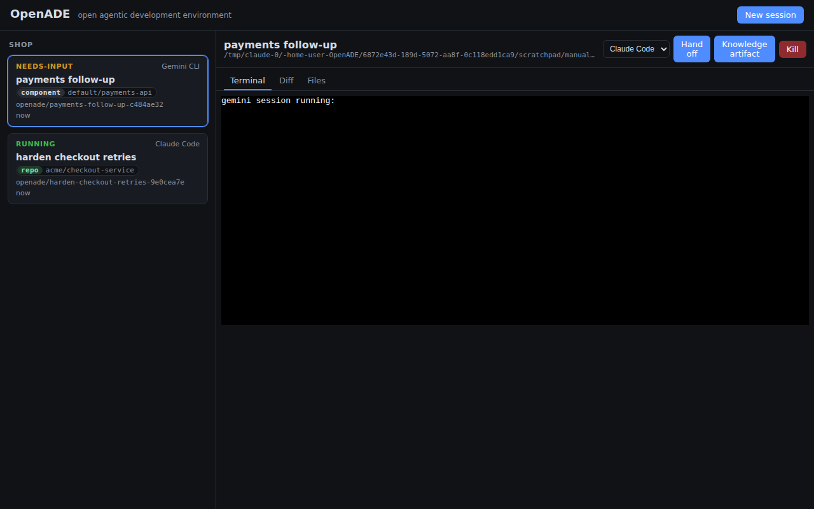

# OpenADE

**An open, vendor-neutral agentic development environment.**

> Status: **alpha**. The daemon, context layer, and UI work end-to-end (see
> the [manual verification record](docs/manual-e2e.md)); the harness CLI
> integrations ship with adapter mappings that are still being verified
> against current vendor CLI releases ([Phase 0 spike](docs/phase-0-spike.md)).
> "OpenADE" is a working codename (PRD Q4).

OpenADE orchestrates parallel AI coding agent sessions — **Claude Code, Codex
CLI, Gemini CLI** — in isolated Git worktrees from a single control surface,
and grounds every session in your organization's context from a **Backstage**
software catalog via **MCP**: ownership, dependencies, APIs, ADRs, TechDocs.
Session knowledge flows back as reviewed documentation, so every session
makes the next one smarter.

The context layer is open and pluggable — the inverse of commercial,
closed-context agent environments. Bring your own catalog; no accounts, no
telemetry, local-first.



## What it does

- **Parallel sessions, zero collisions** — every task gets its own Git
  worktree on its own branch, with a dirty-state guard on cleanup.
- **Persistent PTY sessions** — harnesses run in daemon-owned terminals that
  survive the window closing; reattach with full scrollback. Session states
  (`running` / `needs-input` / `completed` / `failed`) surface in a grid,
  including prompt detection for "the agent is waiting on you".
- **Context-grounded sessions** — launch from a catalog entity and the agent
  starts with a budgeted context bundle (owner, dependencies, APIs, docs,
  prior session outcomes) injected into its rules file, plus the `catalog`
  MCP server registered for on-demand retrieval (`get_entity`, `get_owner`,
  `get_dependencies`, `get_apis_for_entity`, `search_catalog`,
  `get_techdocs_page`).
- **Knowledge loop** — one click summarizes a session (transcript + diff)
  into a markdown artifact committed on an `openade/knowledge-*` review
  branch under `docs/`; once merged it feeds the context bundle of the next
  session on that entity.
- **Cross-harness handoff** — move a task Claude → Gemini (any direction) in
  place: same worktree and branch, rules re-materialized, a written handoff
  summary, and the new harness prompted to pick up where the old one left
  off.
- **One rules source** — `.openade/rules.md` materializes to `CLAUDE.md` /
  `AGENTS.md` / `GEMINI.md` so behavior doesn't change when you switch
  models (hand-written files are never clobbered).

## Install

**From a release** (Linux x86_64/aarch64, macOS Intel/Apple Silicon):
download the tarball for your platform from
[GitHub Releases](https://github.com/hkd987/OpenADE/releases), verify the
checksum, and put `openade-daemon` and `catalog-mcp` on your PATH.

**From source** (Rust 1.80+):

```sh
cargo install --path crates/openade-daemon --path crates/catalog-mcp
```

The harness CLIs themselves are bring-your-own: install and authenticate
`claude`, `codex`, and/or `gemini` through each vendor's normal flow.
OpenADE never touches their credentials.

## Quickstart

```sh
# 1. Start the daemon (localhost:7433). Optional: point it at your Backstage
#    to get context bundles and catalog MCP tools in every entity session.
export BACKSTAGE_BASE_URL=https://backstage.example.com   # optional
export BACKSTAGE_TOKEN=...                                # optional
openade-daemon

# 2. Launch a session (or use the UI below)
curl -s -X POST localhost:7433/sessions -H 'content-type: application/json' -d '{
  "title": "add retries to the payments client",
  "harness": "claude-code",
  "repo_root": "/path/to/your/repo",
  "entity_ref": "component:default/payments-api",
  "prompt": "Add retries with exponential backoff to the payments client."
}'

# 3. Run the UI (dev mode; Node 20+)
cd apps/desktop && npm install && npm run dev
```

Useful daemon endpoints: `GET /sessions`, `GET /sessions/{id}/scrollback`,
`POST /sessions/{id}/input`, `GET /sessions/{id}/diff`, `.../files`,
`POST /sessions/{id}/artifact`, `POST /sessions/{id}/handoff`,
`DELETE /sessions/{id}`, `DELETE /sessions/{id}/worktree`, `GET /projects`.

Environment knobs: `OPENADE_DAEMON_PORT` (default 7433), `OPENADE_DATA_DIR`
(default `~/.openade` — transcripts, session index, worktrees),
`BACKSTAGE_BASE_URL` / `BACKSTAGE_TOKEN` (context layer),
`VITE_OPENADE_DAEMON_URL` (UI → daemon).

## Architecture

```
┌─────────────────────────────────────────────────────┐
│ Desktop app (Tauri 2: TS/React UI, xterm.js)        │  apps/desktop
└──────────────┬──────────────────────────────────────┘
               │ localhost HTTP
┌──────────────▼──────────────────────────────────────┐
│ Session daemon (Rust)                               │  crates/openade-daemon
│  • PTY host — sessions survive window close         │
│  • Git worktree isolation per task                  │
│  • Harness adapters (claude / codex / gemini)       │
│  • Context bundles + knowledge artifacts            │
│  • Transcript recorder (JSONL + SQLite index)       │
└───────┬─────────────────────────────┬───────────────┘
        │ spawns + MCP config         │
┌───────▼───────────┐        ┌────────▼───────────────┐
│ Harness CLIs      │  MCP   │ catalog-mcp (Rust)     │  crates/catalog-mcp
│ (user-installed,  │◄──────►│  CatalogProvider trait │
│  user-authed)     │        │  └ BackstageProvider   │
└───────────────────┘        └────────┬───────────────┘
                                      │ REST (read-only)
                             ┌────────▼───────────────┐
                             │ Your Backstage         │
                             └────────────────────────┘
```

Shared domain types live in `crates/openade-core`. The catalog backend is
abstracted behind the `CatalogProvider` trait — Backstage is the first
implementation, not a hard dependency.

## Documentation

| Doc | What |
|---|---|
| [PRD](docs/PRD.md) | Product requirements — the why and the roadmap |
| [ADR-001](docs/adr/ADR-001-desktop-shell.md) | Desktop shell decision (Tauri vs Electron vs TUI) |
| [catalog-mcp tools](docs/catalog-mcp-tools.md) | MCP tool schemas, auth, design rules |
| [Phase 0 spike](docs/phase-0-spike.md) | Real-CLI verification plan (the gate to beta) |
| [Testing & coverage](docs/testing.md) | Test strategy, 96.9% line coverage breakdown |
| [Manual e2e record](docs/manual-e2e.md) | By-hand verification of the assembled system |
| [Desktop app](apps/desktop/README.md) | UI development and the Tauri shell |
| [Contributing](CONTRIBUTING.md) | Ground rules and dev setup |

## Testing

```sh
cargo test                                        # 119 Rust tests (real git, real PTYs, mock Backstage, fault injection)
cd apps/desktop && npm test                       # UI unit tests (vitest)
cd apps/desktop && npm run e2e                    # 10 Playwright flows: real daemon + mock Backstage + real Chromium
```

Product-code line coverage is 100% on both the Rust workspace and the UI —
methodology and the e2e flow matrix are in [docs/testing.md](docs/testing.md);
the by-hand verification (including the native Tauri shell under WebKitGTK)
is in [docs/manual-e2e.md](docs/manual-e2e.md).

CI runs fmt, clippy (`-D warnings`), all three test layers, and a
Tauri-shell compile check. Releases are built by tagging `v*` (see
`.github/workflows/release.yml`).

## Principles

- **No model access in our code.** You authenticate each harness through its
  own CLI; OpenADE never proxies API keys.
- **Local-first.** Transcripts and session state stay on your machine unless
  you explicitly publish a knowledge artifact (as a reviewable Git branch).
- **Two swappable layers.** Harnesses behind adapters; catalogs behind
  `CatalogProvider`. No lock-in on either side.

## License

[Apache-2.0](LICENSE)
