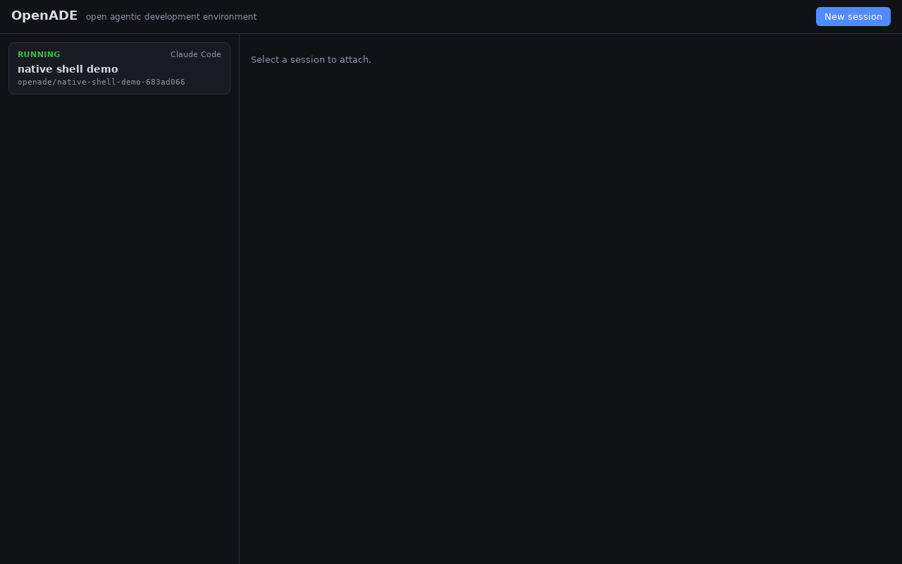

# Manual end-to-end verification

**Date:** 2026-08-11 · **Build:** release binaries (`cargo build --release`)
· **Environment:** Linux container; harness CLIs stood in by interactive
shell shims on PATH; Backstage stood in by a local mock serving the catalog
by-name/by-query and TechDocs REST endpoints.

Everything below was executed by hand against the assembled system (not the
test suite): `openade-daemon` release binary + mock Backstage + built UI in
real Chromium.

*The grid above (captured during this pass) shows the three states exercised —
a Codex session waiting on input, a killed Gemini session, and a completed
Claude session — across both memory sources (`component:default/payments-api`
chips and a green `repo:acme/checkout-service` chip), with the compact
Handoff / Artifact / Kill actions in the detail header.*

## Checklist and observed results

| # | Step | Result |
|---|---|---|
| 1 | `GET /health` on the release daemon | `{"status":"ok","version":"0.1.0"}` |
| 2 | Launch entity session (`component:default/payments-api`, Claude, prompt) | `running`, task branch `openade/add-idempotency-keys-*`, isolated worktree |
| 3 | Context bundle injection | `CLAUDE.md` carries "System context: Payments API" incl. owner "Payments Team" from mock Backstage; `.openade/context.{md,json}` written |
| 4 | Catalog MCP auto-registration | `.mcp.json` in worktree registers `catalog` → `catalog-mcp` (stdio) |
| 5 | Scrollback | Shim banner + passed-through prompt visible via `GET .../scrollback` |
| 6 | Needs-input detection | After the PTY echoed a `(y/n)` prompt and quiesced, `GET /sessions/{id}` flipped to `needs-input` |
| 7 | Diff view | Edit to `README.md` in the worktree appears as `+idempotency keys added` |
| 8 | File browser | Lists tracked + generated files, gitignore respected |
| 9 | Projects | Repo listed from the session index |
| 10 | Knowledge artifact | Committed to branch `openade/knowledge-2026-08-11-add-idempotency-keys-*` at `docs/openade/sessions/…md`; primary checkout untouched (`git status` clean) |
| 11 | Handoff Claude → Gemini | Same worktree/branch, `GEMINI.md` gets the context bundle, `.openade/handoff.md` written, new PTY got the takeover prompt |
| 12 | Knowledge loop | A follow-up session on the same entity received "Prior sessions on this entity" with the earlier outcomes in its bundle |
| 13 | Kill + cleanup | Kill → `failed`; worktree delete → `409` while dirty, `204` with `?force=true`, directory removed |
| 14 | `catalog-mcp` binary over stdio vs. mock Backstage | `initialize` handshake; `get_owner` → "Payments Team"; `search_catalog` → payments-api, ledger; `get_techdocs_page` → ADR content |
| 15 | UI in Chromium (production build via `vite preview`) | Grid renders all sessions/states, terminal attaches and streams, tabs and action buttons work (screenshot above) |

## Native Tauri shell (verified)

After installing WebKitGTK in the container, the native shell was built and
run under Xvfb against a live daemon — the screenshot below is the actual
WebKitGTK window (not a browser) showing a running session in the grid:

| # | Step | Result |
|---|---|---|
| 16 | `cargo build` of `apps/desktop/src-tauri` with system WebKitGTK | Compiles clean (icon embedded from `icons/icon.png`) |
| 17 | Launch `openade-desktop` under Xvfb with no daemon | Window opens; UI renders with the "cannot reach daemon" banner (correct failure mode) |
| 18 | Launch with a live daemon + session | Grid shows the running session in the native webview (screenshot above) |

## GitHub memory source via the local gh CLI (verified)

Re-run on 2026-08-11 against the release binaries with a `gh` shim on PATH
standing in for the authenticated GitHub CLI (plus the mock Backstage). The
screenshot above is from this pass — both memory chips visible.

| # | Step | Result |
|---|---|---|
| 19 | Daemon startup source detection | Log shows `memory sources: github, backstage` with no GitHub-specific env set — `gh` auto-detected on PATH |
| 20 | `repo:acme/checkout-service` session launch | `CLAUDE.md` carries "System context: acme/checkout-service" (kind repo, type Go), description, and CODEOWNERS-derived owner `group:acme/checkout-team` |
| 21 | Backstage regression | `component:default/payments-api` session still injects "Payments Team" (Gemini rules file) |
| 22 | `catalog-mcp` stdio with both sources | `get_owner(repo:…)` → team + user from CODEOWNERS; `get_techdocs_page(README.md)` → file content via `gh api`; `search_catalog("checkout")` → results from **both** sources merged; `get_entity(component:…)` still served by Backstage |
| 23 | UI memory chips | Grid shows `component`-chip and green `repo`-chip cards side by side (screenshot above) |

## Shared team memory repo (verified)

Run on 2026-08-11 against the release daemon with
`OPENADE_MEMORY_REPO=acme/team-memory` set and a stateful `gh` shim standing
in for the GitHub contents API (writes land in a state directory, sha
required for updates — same contract as api.github.com).

| # | Step | Result |
|---|---|---|
| 24 | Daemon startup | Log shows `shared memory repo: acme/team-memory` alongside the memory sources |
| 25 | Artifact publication | `POST /sessions/{id}/artifact` response carries `shared_repo: acme/team-memory` + `shared_path: sessions/2026-08-11-…md`; the shim state shows the session document **and** a regenerated `index.md` (newest-first, entity ref in the entry) committed straight to the default branch |
| 26 | Knowledge loop across the team | A follow-up session on `repo:acme/checkout-service` got the shared entry under "Prior sessions on this entity" (tagged `shared-memory`) plus a "Shared team memory (acme/team-memory)" doc link in `CLAUDE.md` and `.openade/context.json` |
| 27 | Degradation | With the `gh` binary removed, publication still succeeds locally (review branch) and the response has no `shared_*` fields — covered by unit tests and re-checked by hand |

## GitHub memory through the app, by hand (verified)

Run on 2026-08-11 driving the real UI in Chromium (Vite + daemon +
`gh`/harness shims) click-for-click as a user — form fill, terminal typing,
button presses — rather than through the HTTP API:

| # | Step | Result |
|---|---|---|
| 28 | Launch form, entity `repo:acme/checkout-service` | Dual-source hint under the field; session launches from the form; card shows the green `repo` chip |
| 29 | Terminal | Attaches live, shows the harness banner + passed-through prompt; typing `exit` into the terminal ends the session → card flips to `completed` |
| 30 | Context bundle | Worktree `CLAUDE.md` carries the repo description, CODEOWNERS owner `group:acme/checkout-team`, and the "Shared team memory (acme/team-memory)" doc link |
| 31 | Artifact button | Banner shows the review branch **and** "Also pushed to team memory acme/team-memory" with a link to the shared document (screenshot below); the shared repo state gained `sessions/…md` + updated `index.md` |
| 32 | Team knowledge loop | A second session launched from the form on the same entity got the first session's shared-memory entry under "Prior sessions on this entity" |
| 33 | `gh` setup diagnostics | Booted the daemon (a) with a logged-out `gh`: startup warns "the GitHub CLI at … is not authenticated … install the GitHub CLI from https://cli.github.com, authenticate with `gh auth login`"; (b) with no `gh` and `OPENADE_MEMORY_REPO` set: warns the repo is configured but no gh CLI was found, with the same fix — nothing fails silently |
| 34 | Zero-config grounding | Release daemon, **no** `entity_ref` in the launch and **no** memory env vars: the session auto-grounded in the repo's GitHub `origin` remote (`entity_ref: repo:acme/checkout-service` in the response; `CLAUDE.md` carries the description + CODEOWNERS owner) |
| 35 | Zero-config shared memory | Same run: the repo's committed `.openade/memory-repo` (`acme/team-memory`) alone routed the published artifact to the shared repo — `shared_repo`/`shared_path` in the response, session doc + `index.md` in the shim state — with no per-user configuration at all |
| 36 | First-run onboarding | Fresh daemon (no env, no `config.json`) + UI in Chromium: the welcome flow appears with "✓ GitHub memory is ready" (authenticated `gh` shim probed via `gh auth status`); entering `acme/team-memory` and pressing "Save & start" dismissed it, `GET /config` reported the saved repo + `onboarded: true`, `config.json` appeared in the data dir, and a reload did not re-onboard (screenshot in README) |
| 37 | Onboarding guardrails | `PUT /config` with a malformed repo → 400 with the reason; daemon-side env vars (`BACKSTAGE_BASE_URL`/`OPENADE_MEMORY_REPO`) mark the daemon pre-onboarded so operators never see the flow; the signed-out/missing-`gh` states render the fix instructions (`gh auth login` / cli.github.com) in the status card |

## Not verifiable in this environment

- The real `claude` / `codex` / `gemini` CLIs (no vendor credentials in the
  container) — adapter flags remain gated on the
  [Phase 0 spike](phase-0-spike.md) run on a developer machine.
- A production Backstage instance — the REST surface was mocked
  byte-for-byte per the API docs; `wiremock` tests cover the same paths.
- A real authenticated `gh` CLI (no GitHub credentials in the container) —
  the shim reproduces gh's documented JSON and error shapes; the provider's
  fault paths are unit-tested against failing shims. Same gating as the
  harness CLIs.

## Reproducing this pass

The e2e suite automates the same story: `cd apps/desktop && npm run e2e`.
To do it by hand, follow the commands in this file's history or the
quickstart in the [README](../README.md), exporting `BACKSTAGE_BASE_URL`
(and optionally `BACKSTAGE_TOKEN`) before starting the daemon.
