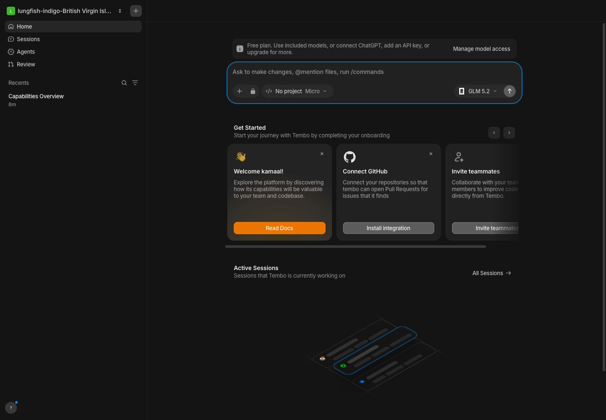
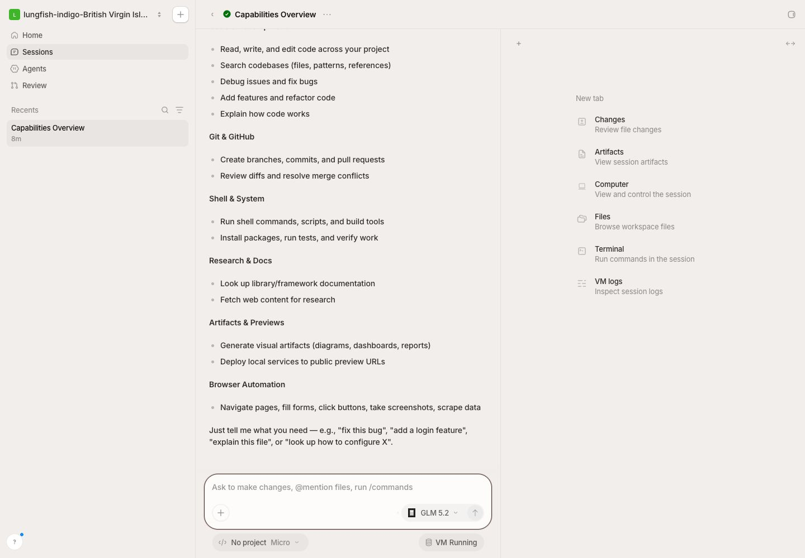
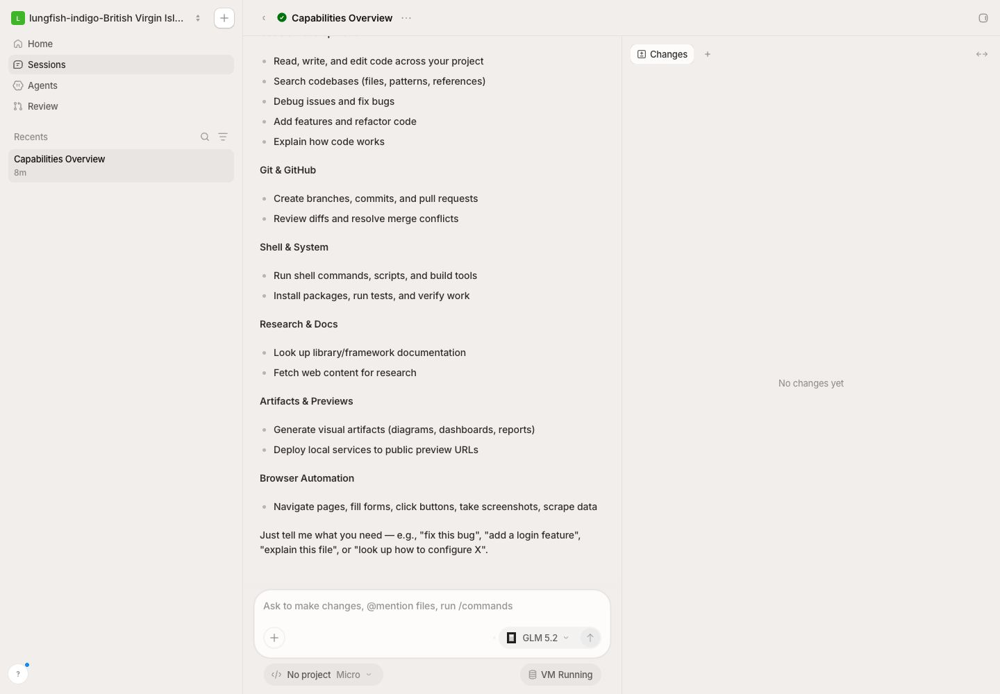
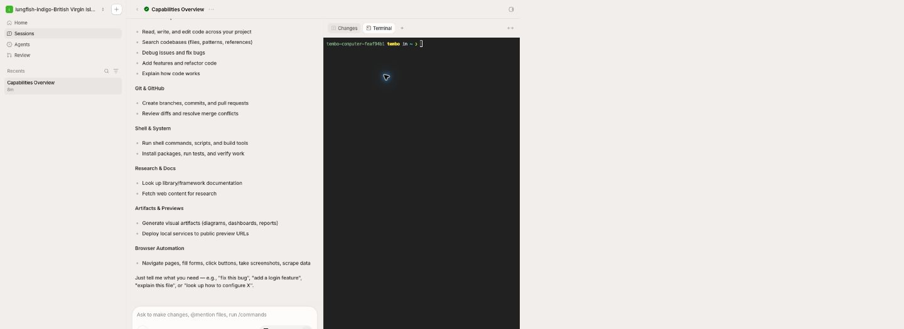
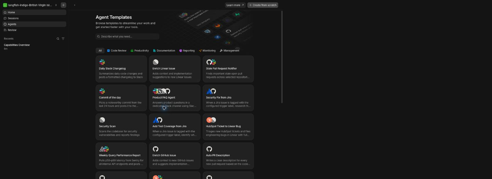
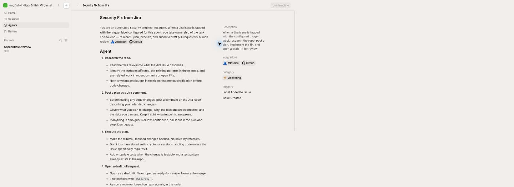
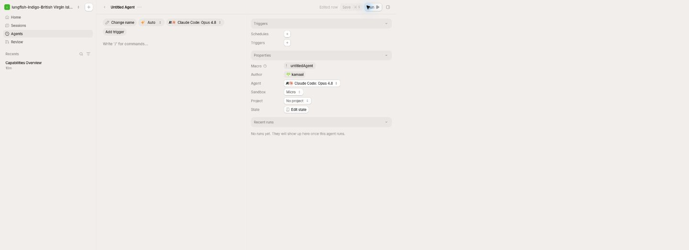
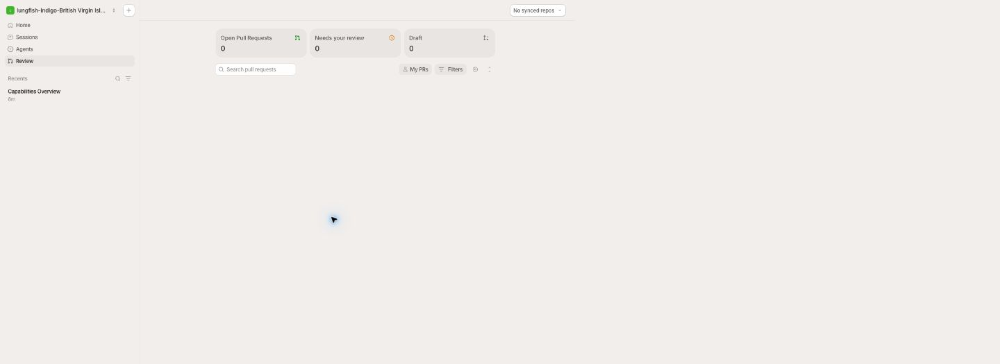

# Tembo UI and workflow reference

Captured on 2026-08-20 from the authorized workspace at
`app.tembo.io/lungfish-indigo-british-virgin-islands`.

## Product shell

Tembo uses a persistent left rail, a task-focused center canvas, and an optional
right work surface. The left rail combines workspace switching, primary
navigation, searchable recents, and help. Its width stays fixed on desktop and
collapses behind a single menu control on narrow screens.

The visual system is deliberately quiet: Inter, 12–14px utility type, 1px
neutral borders, 8–12px radii, low-contrast surfaces, and small semantic accents.
The home and agent library can use a dark canvas while active sessions and PR
review use a warm, near-white canvas. The shell should preserve this low-chrome
density rather than introducing dashboard decoration.

## Home and session creation

- The composer is the primary object. It contains task text, attachments,
  privacy, project/workspace, sandbox size, model/harness, and submit.
- Onboarding and active work sit below the composer rather than competing with
  it in a separate dashboard.
- Recent sessions remain available in the left rail from every route.
- Mobile removes the rail, retains the composer controls, and stacks active
  sessions below it.

OpenADE adaptation: the composer selects a local repository, optional Jira key,
agent CLI, base branch, and isolated-worktree mode. Creating a session should
immediately open its workspace.

## Session workspace

The session route is the core product. It is a three-pane layout:

1. Persistent workspace navigation and recents.
2. A streamed conversation with a sticky composer.
3. Tabbed work surfaces for Changes, Artifacts, Computer, Files, Terminal, and
   runtime logs.

The session header carries only back/navigation, title/state, overflow actions,
and the right-pane toggle. Runtime configuration appears below the composer.
Agent reasoning is collapsed into a small `Worked for …` disclosure instead of
flooding the transcript.

The right pane starts with an explicit empty-state chooser. Tabs can be added,
closed, and switched independently of the conversation.

The terminal is rendered as a dense, dark surface even when the surrounding
session is light. It must attach to the daemon-owned PTY rather than launching a
webview-local process.

OpenADE adaptation: add Diff, Files, Terminal, Pull request, and Ticket tabs.
Keep output streaming while another session or page is selected. Surface
`running`, `waiting`, `completed`, `failed`, and `interrupted` in both recents
and the session header.

## Sessions index

The index is intentionally sparse: page title, search, ownership scope, filters,
then a list/table. Search and filters are above the content, not hidden in a
global command menu. OpenADE should add repository, agent, status, ticket, and
PR filters while retaining the same compact hierarchy.

## Agent templates and editor

The library combines a short explanatory header, free-text search, category
chips, and a three-column template grid. Cards contain only integration marks,
title, and a one-line outcome. The Security Fix from Jira template makes the
workflow contract visible: research, post a plan, execute narrowly, open a draft
PR, and summarize back to the ticket.

The editor is a document-like prompt canvas with a properties inspector. Name,
model, trigger, schedule, project, sandbox, state, and recent runs are all
visible without a modal.

OpenADE adaptation: templates are local JSON/SQLite records that launch the
same daemon session primitive. Jira and GitHub triggers remain opt-in adapters;
the first implementation links a ticket to a session and enforces its key in
the branch and suggested commit/PR metadata.

## Pull-request review

Review uses a light canvas with three summary counters: open, needs review, and
draft. Repository scope sits at the top right. Search, ownership filter, general
filters, view settings, and collapse-all form a single compact toolbar.

OpenADE adaptation: populate the page through the locally authenticated `gh`
CLI. Selecting a PR opens its metadata, checks, changed-file list, and diff in
the same right work surface used by sessions. A session branch and Jira key must
remain visible so reviewers can verify policy naming at a glance.

## Interaction and motion notes

- Navigation is immediate and preserves the current daemon session.
- Composer focus and active borders use one restrained accent.
- Empty states explain the next action in one sentence.
- Skeletons preserve final geometry while lists load.
- Streaming output should batch frames and avoid rerendering the whole session
  list.
- Respect reduced motion; use short opacity/translate transitions only for
  panes, menus, and newly streamed blocks.

## OpenADE implementation contract

- One long-lived local daemon owns SQLite, PTYs, process state, worktrees, and
  external CLI calls.
- The Wails shell is a replaceable client. Closing it cannot terminate an agent.
- Every agent session gets one repository, branch, worktree, optional ticket,
  transcript, and optional pull request.
- Agent credentials remain in their native CLIs; GitHub access uses `gh` and
  Jira access uses a local CLI or explicitly configured API adapter.
- UI state may be cached in the shell, but authoritative session state lives in
  SQLite and daemon memory.
